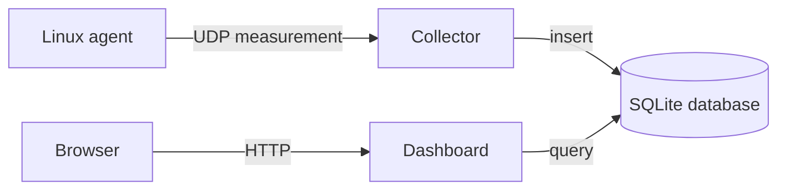

# EdgeLens

EdgeLens collects Linux system metrics from edge machines, sends them to a collector over UDP, stores them in SQLite, and serves a local web dashboard.

## Architecture



The collector and dashboard should run on the same host as the SQLite database. SQLite is an embedded, local database: it is a file accessed by processes on one machine, not a network database.

## Run a local demo

Use separate terminals from the repository root:

```bash
# Terminal 1: receives UDP measurements and stores them.
go run ./cmd/collector

# Terminal 2: sends Linux metrics to the local collector.
go run ./cmd/agent

# Terminal 3: serves the dashboard.
go run ./cmd/dashboard
```

Open http://localhost:8080 in a browser.

The agent defaults to collecting from Raspberry Pi-style device names (`mmcblk0` and `eth0`). On a Mac, the agent will not work because it reads Linux `/proc` files. The collector and dashboard can run on macOS or Linux.

## Run on separate machines

Assume the collector machine has LAN address `192.168.1.20` and the agent is a Raspberry Pi.

On the collector host, use one data directory and point both processes at the same database file:

```bash
mkdir -p "$HOME/.local/share/edgelens"

go run ./cmd/collector \
  -udp-address :9000 \
  -database "$HOME/.local/share/edgelens/measurements.db"
```

In another terminal on that host, start the dashboard:

```bash
go run ./cmd/dashboard \
  -database "$HOME/.local/share/edgelens/measurements.db" \
  -address 127.0.0.1:8080
```

On the Pi, send to the collector's LAN address:

```bash
go run ./cmd/agent \
  -collector 192.168.1.20:9000 \
  -host edge-pi-01 \
  -disk-device mmcblk0 \
  -disk-mount / \
  -network-interface eth0 \
  -report-delay 5s
```

To view the dashboard from another trusted device on the LAN, bind it to all network interfaces:

```bash
go run ./cmd/dashboard \
  -database "$HOME/.local/share/edgelens/measurements.db" \
  -address :8080
```

Then open `http://192.168.1.20:8080`. Do not expose this unauthenticated HTTP server directly to the public internet.

## Configuration

Run `go run ./cmd/<command> -h` to see available flags.

### Agent

| Flag | Purpose | Default |
|---|---|---|
| `-collector` | UDP destination as `host:port` | `127.0.0.1:9000` |
| `-host` | Logical identity stored with each measurement | OS hostname |
| `-report-delay` | Delay after completing and sending one snapshot before gathering the next | `5s` |
| `-disk-device` | Linux block device used for disk I/O rates | `mmcblk0` |
| `-disk-mount` | Mounted filesystem used for disk usage | `/` |
| `-network-interface` | Linux network interface used for network rates | `eth0` |

Use `ip link` to list network interfaces and `lsblk` to list block devices. Common alternative names include `wlan0`, `enp0s3`, and `nvme0n1`.

`-report-delay` is separate from the metric sampling configuration. CPU, disk I/O, and network I/O each observe their OS counters over the one-second windows in `DefaultSamplingConfig`. Those operations currently run sequentially, so a sent record arrives approximately every:

$$
T_{record} \approx T_{CPU\ sample} + T_{disk\ sample} + T_{network\ sample} + T_{report\ delay}
$$

With the defaults, that is roughly $1s + 1s + 1s + 5s = 8s$.

### Collector

| Flag | Purpose | Default |
|---|---|---|
| `-database` | Local SQLite database file | `measurements.db` |
| `-udp-address` | Local UDP bind address | `:9000` |

`-udp-address :9000` means “listen on port 9000 on every IPv4/IPv6 network interface the OS makes available.” A more restrictive value such as `127.0.0.1:9000` accepts packets only from the same machine. Use `192.168.1.20:9000` to listen only on one LAN interface.

### Dashboard

| Flag | Purpose | Default |
|---|---|---|
| `-database` | Local SQLite database file to read | `measurements.db` |
| `-address` | TCP address for HTTP requests | `:8080` |

`127.0.0.1:8080` accepts dashboard connections only from the local machine. `:8080` listens on all interfaces, allowing LAN clients through if host firewall rules permit it.

## What the operating system does for UDP

An address such as `192.168.1.20:9000` has two independent parts:

- The IP address identifies a network interface and host.
- The port identifies a receiving application on that host.

When the collector calls Go's `net.ListenUDP`, Go asks the OS kernel to create a UDP socket and bind it to the chosen local address and port. The kernel maintains a socket table, so when a UDP packet arrives for port `9000`, it delivers that datagram to the collector process rather than to another program.

When the agent sends a measurement, the OS network stack performs these steps:

1. Go gives the encoded JSON bytes and destination address to the kernel through the socket API.
2. The kernel wraps the data in a UDP datagram, which adds source and destination port numbers.
3. The kernel wraps that in an IP packet, which adds source and destination IP addresses.
4. The routing table selects an outgoing interface and next hop. On a typical home LAN, the next hop is either the collector itself or the local router.
5. Ethernet or Wi-Fi requires a link-layer destination address. The OS normally uses ARP for IPv4 to map the next-hop IP address to a MAC address.
6. The network delivers the frame. The collector host removes the link and IP headers, matches the UDP destination port to its socket, and queues the payload for `ReadFromUDP`.

UDP is connectionless: there is no TCP-style handshake, acknowledgement, ordering guarantee, or automatic retransmission. A successful `Send` means the local kernel accepted the packet; it does not prove that the collector stored it. That is an acceptable trade-off for frequent, best-effort system telemetry, and the database primary key `(host, timestamp)` makes duplicate delivery harmless.

For remote agents, the collector host must permit inbound UDP on the configured port. On Linux with UFW, for example:

```bash
sudo ufw allow 9000/udp
```

Also ensure the agents can route to the collector IP. `ping 192.168.1.20` tests basic IP reachability, but it does not prove UDP port 9000 is allowed or that the collector is running.

## Build binaries

Go can cross-compile each command for the target operating system and CPU architecture:

```bash
GOOS=linux GOARCH=arm64 go build -o edgelens-agent ./cmd/agent
GOOS=linux GOARCH=amd64 go build -o edgelens-collector ./cmd/collector
GOOS=linux GOARCH=amd64 go build -o edgelens-dashboard ./cmd/dashboard
```

On the target machine, check the required architecture with `uname -m`. A 32-bit Raspberry Pi OS commonly needs `GOARCH=arm`; a 64-bit Raspberry Pi OS normally needs `GOARCH=arm64`.
